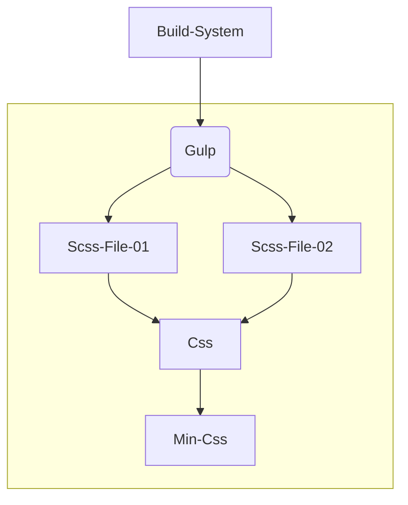

<h1 align="center">Front-End Project Structure</h1>
<p align="center"><i>For HTML/SCSS/JS</i></p> 

## Usage :rocket:
First Install the packages, more likely the build system task runner packages.
```sh
$ npm install
```
Run this while developing, for reloading the stylesheets and so on.
```sh
$ gulp
```
### Directories
**`./src`** - All `.scss`styles are stored in the `/styles` folder. Every Javascript file finds place in the `./scripts` folder. For External Libraries and components use the `/vendor` directories inside these.<br>
**`./build`** - Compiled and Minified `.css` - stylesheets and `.js` files finding place there.

## Build System :package:
Using Gulp for the Build System of `SCSS` to `CSS` and `JS` within the minified versions.
```sh
$ gulp
```

### Structure :recycle:
A gulpfile is a file in your project directory titled `gulpfile.js` (like Makefile), that automatically loads when you run the `gulp` command. Within this file, you'll often see gulp APIs, like `src()`, `dest()`, `series()`, or `parallel()` but any vanilla JavaScript or Node modules can be used. Any exported functions will be registered into gulp's task system.



<div style="border-top: 1px solid;">

<span style="color: gray; font-size: 12px;">©Baris Tikir 2020 
